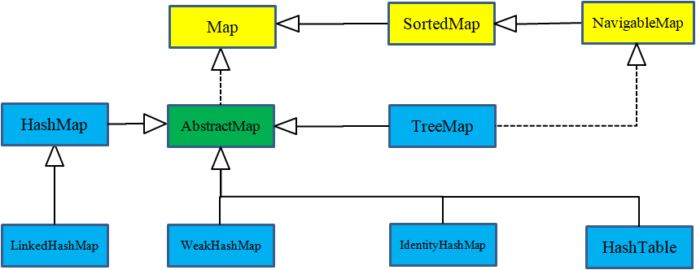

 
<div class = 'data-section default-folding'>
<h2 class = 'section-title'>第 <label class = 'block-number'>1</label> 章：字符串</h2>
<div class = 'folding-area'>

String 底层是 `final char[]`, 它是不可变的

StringBuild 底层是 `char[]`, 默认情况下初始化长度为 16, 当插入的 char 达到一定数量时，就会自动扩容 为原来的 2倍 + 2 

```java
private int newCapacity(int minCapacity) {
        // overflow-conscious code
        int newCapacity = (value.length << 1) + 2; //[]
        if (newCapacity - minCapacity < 0) {
            newCapacity = minCapacity;
        }
        return (newCapacity <= 0 || MAX_ARRAY_SIZE - newCapacity < 0)
            ? hugeCapacity(minCapacity)
            : newCapacity;
}
```

//TODO

</div>
</div>


<div class = 'data-section default-folding'>
<h2 class = 'section-title'>第 <label class = 'block-number'>2</label> 章：集合</h2>
<div class = 'folding-area'>

<div class="myImage">


<label class="imageTitle"></label>
</div>

<h3 class = 'auto-sort-sub'>散列表</h3>


<h4 class = 'auto-sort-sub1'>Hash</h4>

##### 什么是 hash?
答：hash 也称散列。基本原理就是把`任意长度`的输入，通过 hash 算法变成`固定长度`的输出，原始数据映射后的 `二进制串`就是 哈希值。

##### hash 的特点？
1. 从 hash 值不可以反向推导出原始的数据
1. 输入数据的微小变化会得到完全不同的 hash 值，相同的数据会得到相同的 hash 值
1. 执行效率要高效，长文本也能快速计算出 hash 值
1. 冲突概率要小

<div class="myWarning">

由于 hash 的原理是将`输入空间`的 值映射到`hash 空间`内，而 hash 值的空间远小于输入空间。根据抽屉原理，一定会存在不同的输入被映射成相同输出的情况。
</div>

##### hash 函数

散列函数是可用于将任意大小的数据映射到`固定大小`的值的任何函数。 哈希函数返回的值称为哈希值，哈希码。 这些值用于索引称为哈希表的固定大小的表。 使用哈希函数索引哈希表的过程称为哈希或`分散存储寻址`。

<div class="myNote">

一个好的哈希函数满足两个基本属性：  
1）计算速度应该非常快；
2）应尽量减少输出值重复(冲突)。
</div>

##### hash 表的性能

在维数良好的 [哈希表](https://en.wikipedia.org/wiki/Hash_table) 中，每次查找的平均成本(指令数量)与表中存储的元素`数量`无关。许多哈希表设计还允许任意插入和删除键值对，每次操作的平均成本为`常数`。在许多情况下，哈希表的平均效率比搜索树或其他任何表查找结构都要高。由于这个原因，它们被广泛应用于许多计算机软件中，特别是用于关联数组、数据库索引、缓存和集合。

##### hash 冲突
理想情况下，哈希函数会将每个键分配给唯一的存储桶，但是大多数哈希表设计采用了不完善的哈希函数，这可能会导致哈希冲突。哈希冲突实际上是不可避免的。 例如，如果将2450个 Key 散列到一百万个存储桶中，即使具有完全均匀的随机分布，则根据生日问题，至少有两个 key 散列到同一插槽的可能性大约为 95％。


<h3 class = 'auto-sort-sub'>HashMap</h3>

✿ [HashMap 源码解析](https://ljq199612.gitee.io/Volume/Volume_II/IT/images/java/javase/collection/00.png)


<h4 class = 'auto-sort-sub1'>HashMap 的继承体系</h4>

<div class="myImage">


<label class="imageTitle">图示: HashMap 继承体系</label>
</div>

<h4 class = 'auto-sort-sub1'>HashMap 的存储结构</h4>

<div class="myImage">


<label class="imageTitle">图示: HashMap 存储结构</label>
</div>


<div class="myNote">

**解决哈希碰撞的方式？**

**(1) 链地址法**

每个存储桶都是独立的，并且具有某种具有相同索引的条目列表。 哈希表操作的时间是找到存储桶的时间（常数）加上列表操作的时间。

<div class="myImage">


<label class="imageTitle">图示: 链地址法</label>
</div>

在一个好的哈希表中，每个存储桶都有零个或一个条目，有时有两个或三个，但很少有更多。 因此，对于这些情况在时间和空间上有效的结构是优选的。 不需要对每个存储桶有足够数量的条目有效的结构。 如果这些情况经常发生，则需要修改哈希函数。

**其他结构**
除了列表以外，还可以使用支持所需操作的任何其他数据结构。 例如，通过使用`自平衡二进制搜索树`，可以将常见哈希表操作（插入，删除，查找）的最坏情况理论时间降低到 O(log n) 而不是 O(n)。 但是，这给实现带来了额外的复杂性，并可能导致较小的哈希表的性能更差(哈希表插入和平衡树所花费的时间大于对列表的所有元素执行线性搜索所需的时间) 。`Java 8` 中的 HashMap 类是哈希表的真实示例，该哈希表对存储桶使用了自平衡二进制搜索树。

**(2) 开地址法**

<div class="myImage">


<label class="imageTitle">图示: 开地址法</label>
</div>

**(3) 再散列**

**(4) 公共溢出池**
</div>


<h4 class = 'auto-sort-sub1'>影响 HashMap 性能的参数</h4>

`初始容量`和`负载因子`。 

- 容量(默认16)：哈希表中存储桶的数量，初始容量只是创建哈希表时的容量。 
- 负载因子(默认 0.75)：在自动增加其哈希表容量之前允许哈希表获得的满度的度量。 

当哈希表中的条目数`超过负载因子和当前容量的乘积`时，哈希表将被重新哈希（即，内部数据结构将被重建）。

通常，默认负载因子（.75）在`时间和空间`成本之间提供了一个很好的权衡。 较高的值会减少空间开销，但会增加查找成本（在HashMap类的大多数操作中都得到体现，包括get和put）。 设置其初始容量时，应考虑映射中的预期条目数及其负载因子，以最大程度地减少重新哈希操作的数量。 如果初始容量大于最大条目数除以负载因子，则不会发生任何哈希操作。

<div class="myWarning">

如果迭代性能很重要，则不要将初始容量设置得过高或负载因子过低。
</div>

<h4 class = 'auto-sort-sub1'>index 计算方式</h4>

hash 值为int，index 需要映射到`0 ～ length -1`，最直观的使用`取模`运算, 而 HashMap 使用的是`位运算`

> index = hash值 & (length-1)

hash 值的计算
```java
static final int hash(Object key) {
        int h;
        return (key == null) ? 0 : (h = key.hashCode()) ^ (h >>> 16);
    }
```
当length的长度是2的n次方时，有以下的公式成立:

$$ num\ \%\ 2^n=num\ \&\ (2^n-1)$$

这也解释了为什么 HashMap 每次扩容都是原来的 2 倍

<h4 class = 'auto-sort-sub1'>HashMap 扩容方式</h4>

当 HashMap中的元素个数超过数组大小 * loadFactor 时，就会进行数组扩容，默认情况下，loadFactor 的值为 0.75，数组大小为 16，那么当 HashMap 中元素个数超过 16 * 0.75=12 的时候，就把数组的大小扩展为2 * 16=32，即扩大一倍，然后`重新计算每个元素在数组中的位置，而这是一个非常消耗性能的操作`，所以如果我们已经预知 HashMap 中元素的个数，那么预设元素的个数能够有效的提高 HashMap 的性能。

<div class="myWarning">

1. HashMap 不支持动态缩减容量(java 原则，空间换时间)

1. 在多线程的情况下，当重新调整 HashMap 大小的时候，就会存在`条件竞争`，因为如果两个线程都发现 HashMap 需要重新调整大小了，它们会同时试着调整大小。
</div>

##### HashMap 链表采用头插法还是尾插法？
JDK 8 开始采用尾插法，之前采用头插法。

##### HashMap 遍历方式
一个槽（包括槽下面的列表）一个槽地遍历

<h4 class = 'auto-sort-sub1'>HashMap 与 HashTable 的比较</h4>

HashMap类与HashTable大致等效，不同之处在于它是不同步的，并且允许为 null 和 null 键
- 如果需要线程安全，最好在创建的时候进行同步
```java
Map m = Collections.synchronizedMap(new HashMap(...));
```

<h3 class = 'auto-sort-sub'>List</h3>

<h4 class = 'auto-sort-sub1'>ArrayList</h4>

初始默认长度为 10, 扩展后的长度为原来的 1.5 倍

</div>
</div>


